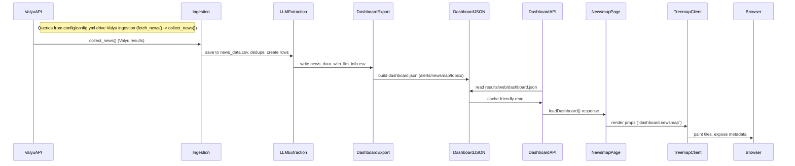
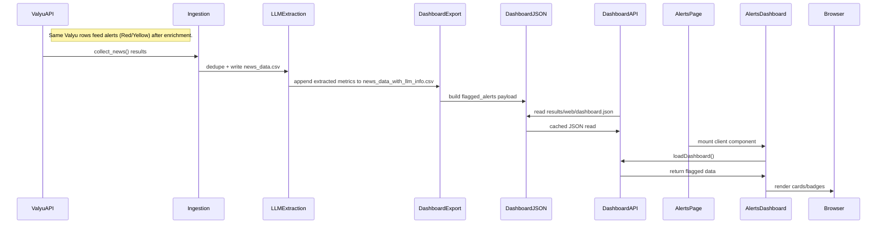
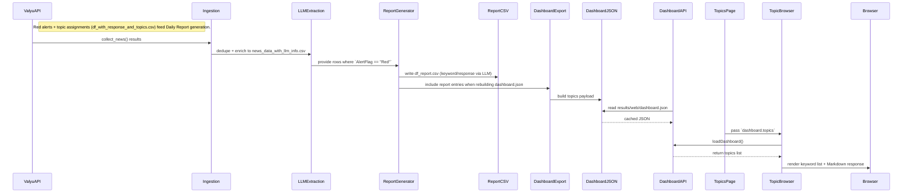

# End-to-End Data Trace for Newsmap, Alerts, and Report

## Valyu Ingestion Source
- **Raw origin**: Valyu search results are pulled through `src/services/ingestion.py` → `collect_news()` which calls `src/adapters/valyu.py` (the Valyu API wrapper) using the queries from `config/config.yml`.
- **Storage**: `fetch_news()` dedups and serializes the articles into `results/data/news_data.csv`; subsequent extraction (LLM enrichment) appends to `results/data/news_data_with_llm_info.csv` before the dashboard export rebuilds the JSON consumed by every UI.
- **Contract**: the pipeline assumes Valyu rows contain `Title`, `URL`, `Description`, `Timestamp`, and `Query` so downstream transformations (LLM join, topic tagging, treemap weighting) have a stable system-of-record.

## Unified Data Flow
```mermaid
flowchart LR
    ValyuAPI([Valyu API<br/>(queries from config)])
    CollectNews[collect_news()<br/>`src/services/ingestion.py`]
    RawCSV[results/data/news_data.csv]
    LLMExtract[LLM extraction<br/>`extract_news_info`]
    EnrichedCSV[results/data/news_data_with_llm_info.csv]
    TopicCSV[df_with_response_and_topics.csv]
    ReportGenerator[generate_reports_from_rows()<br/>`src/services/reporting.py`]
    ReportCSV[df_report.csv]
    DashboardExport[export_dashboard()<br/>`src/services/dashboard_export.py`]
    DashboardJSON[results/web/dashboard.json<br/>+ schema]
    DashboardAPI[/api/dashboard]
    NewsmapUI[Newsmap page<br/>`TreemapClient`]
    AlertsUI[Alerts dashboard]
    TopicsUI[Daily report card]

    ValyuAPI --> CollectNews
    CollectNews --> RawCSV
    RawCSV --> LLMExtract
    LLMExtract --> EnrichedCSV
    EnrichedCSV --> ReportGenerator
    ReportGenerator --> ReportCSV
    EnrichedCSV --> DashboardExport
    ReportCSV --> DashboardExport
    EnrichedCSV --> TopicCSV
    TopicCSV --> DashboardExport
    DashboardExport --> DashboardJSON
    DashboardJSON --> DashboardAPI
    DashboardAPI --> NewsmapUI
    DashboardAPI --> AlertsUI
    DashboardAPI --> TopicsUI
```

The unified flowchart above illustrates every processing stage from Valyu ingestion (left) through raw storage, LLM enrichment, report generation, and dashboard export, ending with the three main UIs that consume `results/web/dashboard.json` via `/api/dashboard`. Each arrow corresponds to a concrete call or CSV write, so you can trace any field back to the Valyu API or the derived datasets.

## Newsmap

### Sequence


### Lineage
```mermaid
flowchart LR
    UI[Newsmap tiles (category/flag/leaf title/value/meta)]
    ValyuAPI[Valyu API (queries from config)]
    RawCSV[results/data/news_data.csv]
    subgraph DataPrep
        A[build_newsmap()] -->|reads| NewsCSV[news_data_with_llm_info.csv]
        NewsCSV -->|joined| TopicCSV[df_with_response_and_topics.csv]
    end
    ValyuAPI --> RawCSV
    RawCSV --> NewsCSV
    NewsCSV -->|columns| TitleCol[Title]
    NewsCSV --> AlertFlagCol[AlertFlag]
    NewsCSV --> TimestampCol[Timestamp]
    NewsCSV --> ShortSummaryCol[ShortSummary]
    NewsCSV --> DescriptionCol[Description]
    NewsCSV --> NewsCategoryCol[NewsCategory]
    NewsCSV --> TopicCol[topic]
    NewsCSV --> TopicLabelCol[RelevantKeywords]
    TopicCSV -->|backfills| TopicCol
    NewsmapMeta[meta {title,url,category,alertFlag,shortSummary,description,timestamp,topic,topicLabel}]
    ValueCalc[_value_for_row: ALERT_WEIGHT × recency(age) clamped ≥0.35]
    UI --> NewsmapMeta
    UI --> ValueCalc
    NewsmapMeta --> NewsCSV
    ValueCalc --> NewsCSV
```

### Operational Notes
- **Purpose**: visualize aggregate risk across categories/alert flags by weighting each leaf tile with severity × recency so analysts spot hotspots ([web/app/newsmap/page.tsx](https://example.invalid) and [web/components/newsmap/treemap-client.tsx](https://example.invalid)).
- **Contracts**: expects `DashboardModel.newsmap` built by `src/services/dashboard_export.py` and validated by the generated schema under `results/web/dashboard.schema.json`.
- **Edge Cases**: empty source files yield a single “All News” node; `Timestamp` gaps result in default weight; duplicate titles are deduped per `Title` in `build_alerts()` logic.
- **Authz**: public Next route with no middleware guard.
- **Caching**: `/api/dashboard` applies `cache-control: public, max-age=60` and `revalidate = 60` as configured in [web/app/api/dashboard/route.ts](https://example.invalid).
- **Failure Modes**: missing `news_data_with_llm_info.csv` produces empty `DashboardModel`; `_merge_topics()` silently skips if `df_with_response_and_topics.csv` lacks `topic` column.

## Alerts

### Sequence


### Lineage
```mermaid
flowchart LR
    UI[Alert cards (title, summary, category, reason, timestamp, badge)]
    AlertsModel[AlertItem (Pydantic) from src/models/dashboard.py]
    AlertsModel --> UI
    AlertsBuilder[_build_flagged_alerts()] --> AlertsModel
    ValyuAPI[Valyu API source rows]
    RawCSV[results/data/news_data.csv]
    NewsCSV[news_data_with_llm_info.csv] -->|fields| TitleCol[Title]
    NewsCSV --> ShortSummaryCol[ShortSummary]
    NewsCSV --> NewsCategoryCol[NewsCategory]
    NewsCSV --> AlertReasonCol[AlertReason]
    NewsCSV --> TimestampCol[Timestamp]
    NewsCSV --> AlertFlagCol[AlertFlag]
    AlertsBuilder --> NewsCSV
    ValyuAPI --> RawCSV --> NewsCSV
```

### Operational Notes
- **Purpose**: show high/medium risk alerts in separate sections so analysts scan titles, summaries, and risk badges (see [web/app/alerts/page.tsx](https://example.invalid) and [web/components/alerts/alerts-dashboard.tsx](https://example.invalid)).
- **Contracts**: consumes `DashboardModel.flagged_alerts` (two lists of `AlertItem`) and paginates via client state (`visibleRed/visibleYellow`).
- **Data Origin**: every AlertItem is derived from Valyu API rows that were stored in `results/data/news_data_with_llm_info.csv` after `fetch_news()` and LLM enrichment.
- **Edge Cases**: search/filter is case-insensitive and trims query; “Load more” increments slices by `pageStep` (100). If no alerts exist, `AlertList` shows “No alerts available.”
- **Authz**: public page.
- **Caching**: relies on `/api/dashboard` cache (same 60 s as newsmap) plus client memoization in `filterItems()`.
- **Failure Modes**: missing `AlertFlag` yields empty payload; fallback `loadDashboard()` returns default lists so UI shows empty state.

## Report (Daily Keyword → Response)

### Sequence


### Lineage
```mermaid
flowchart LR
    UI[Daily report card (keyword buttons + Markdown response)]
    TopicEntry[TopicEntry {keyword,response}]
    TopicEntry --> UI
    load_topics()[results/web/dashboard.json → df_report.csv]
    ReportCSV[df_report.csv] -->|columns| KeywordCol[keyword]
    ReportCSV --> ResponseCol[response]
    generate_reports_from_rows() --> ReportCSV
    ValyuAPI[Valyu API rows]
    RawCSV[results/data/news_data.csv]
    NewsCSV[news_data_with_llm_info.csv] -->|AlertFlag='Red'| ShortSummaryCol
    NewsCSV --> TopicCol[topic]
    TopicCSV[df_with_response_and_topics.csv] --> TopicCol
    ReportGenerator[LLM `generate_report_section()`] --> ReportCSV
    ValyuAPI --> RawCSV --> NewsCSV
```

### Operational Notes
- **Purpose**: expose AI summaries of high-risk topics so stakeholders read distilled narratives ([web/components/topics/topic-browser.tsx](https://example.invalid)).
- **Contracts**: `TopicBrowser` requires `TopicEntry` list from `DashboardModel.topics` (keyword + response). `df_report.csv` is produced by `generate_reports_from_rows()` in `src/services/reporting.py` and read by `load_topics()` ([src/services/dashboard_export.py](https://example.invalid)).
- **Data Origin**: keywords/responses are generated from Valyu rows where `AlertFlag == "Red"` (LLM-enriched records saved in `results/data/news_data_with_llm_info.csv`) plus topic assignments from `df_with_response_and_topics.csv`.
- **Edge Cases**: keyword filter trims/lowercases input; selecting a keyword updates Markdown panel via `ReactMarkdown`; zero topics renders helper text.
- **Authz**: public.
- **Caching**: rides `/api/dashboard` 60 s cache. Scheduled `export_dashboard()` and manual triggers refresh `df_report.csv` before JSON rewrite.
- **Failure Modes**: if `topic` column missing, `generate_reports_from_rows()` raises `ValueError` (pipeline avoids this by `_merge_topics()`); LLM failures mean no new entry, so UI uses prior data or empties gracefully.
