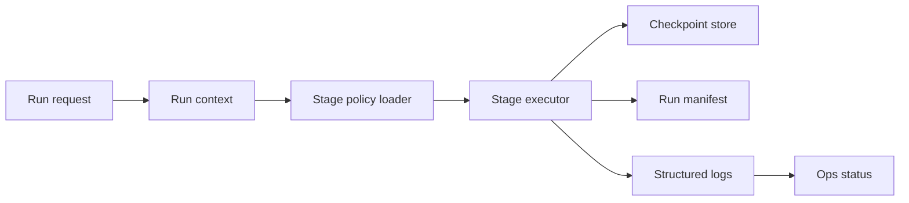

# Agentic Workflow Groundwork (Future Path)

This document defines the agentic workflow path for RiskLive. It is a **future path** and is **separate** from the LangExtract path and the SECA path.

## Status

- Classification: Future path
- Current runtime status in this repository: Not active
- Scope: orchestration and execution control-plane design
- Explicitly out of scope: extraction method selection and clustering algorithm selection

## Why this path exists

The current pipeline is stage-oriented and observable, but execution semantics are still primarily linear and synchronous. Agentic groundwork focuses on stronger run-state management, deterministic replay, resumability, and policy-driven failure handling.

## Current foundations already in repository

- Stage boundaries in `src/services/pipeline.py`
- Agent call sites in `src/agents/extraction/agent.py` and `src/agents/report/agent.py`
- Structured telemetry in `src/utils/logging.py`
- Ops status derivation in `web/lib/ops/status-aggregator.ts`

These are foundations, not a full agentic runtime.

## Target capability model

## 1) Execution envelope

Define and document a run envelope model for every execution:

- run context (`run_id`, trigger source, command, config fingerprint)
- stage inputs (artifact references and versions)
- stage outputs (artifact references and versions)
- stage result (`status`, `duration`, `attempt`, `error class`)
- final run manifest (ordered stage outcomes and summary)

## 2) Stage policy model

Document policy per stage:

- retry budget
- backoff strategy
- timeout budget
- fail action (`retry`, `skip`, `halt`)
- idempotency strategy and key

## 3) Replay and resume model

Document replay/resume behavior:

- start-from-beginning mode
- resume-from-failed-stage mode
- resume-from-named-stage mode
- artifact reuse criteria (schema/version/checksum compatible)

## 4) Error taxonomy

Document normalized error classes:

- config
- validation
- external service
- storage
- unexpected

Each class should define default retryability and escalation expectations.

## 5) Ops compatibility

Agentic evolution must preserve current ops interpretation by continuing to emit canonical run/stage completion events.

## Agentic data and control flow (future)

## Readiness rubric

Use the following readiness statuses per stage:

- `ready`: contracts, idempotency, retries, and replay semantics are fully documented and verified
- `partial`: contracts exist but one or more of retries/resume/replay semantics are missing or unverified
- `blocked`: required contracts or telemetry are absent

## Non-goals

- Replacing topic modeling method
- Choosing LangExtract as mandatory dependency
- Choosing SECA as mandatory dependency

## Acceptance criteria for this documentation path

- The path is clearly independent from LangExtract and SECA paths
- Orchestration contracts are explicit enough to implement without design ambiguity
- Failure, retry, and replay behavior are documented with clear semantics
- Mermaid diagram renders without syntax errors

Back to orientation: [Onboarding Index](./index.md).
