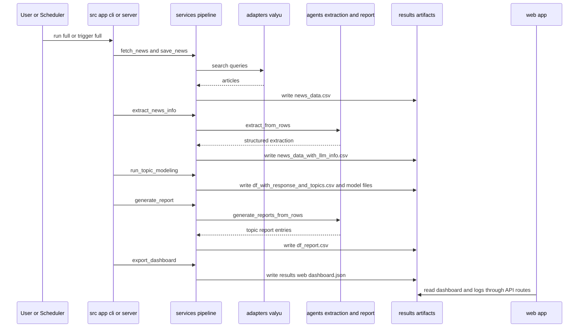
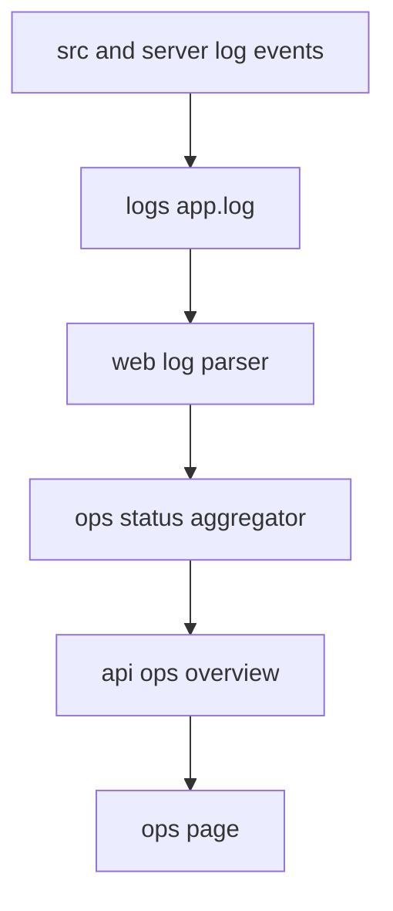
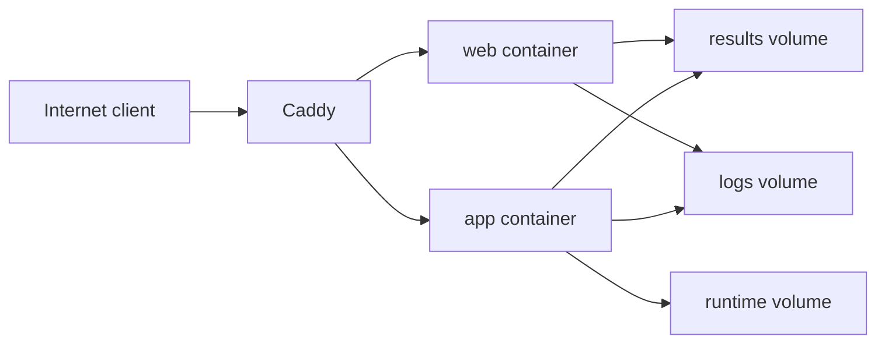
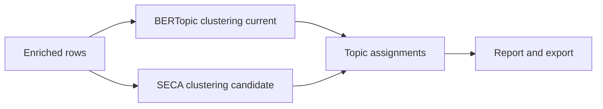

# Current Architecture (`src/` + `web/`)

This is the active implementation for pipeline execution, web UI, and operations visibility.

## Purpose

The current stack preserves the same business workflow as legacy while improving reliability, traceability, and deployability.

## Tech Stack (Current)

### Backend and pipeline

- Python 3.11
- Flask (`src/app/server.py`) for trigger endpoints and scheduler host
- APScheduler for scheduled jobs
- Services architecture in `src/services/*`
- Typed models in `src/models/*`
- Valyu adapter in `src/adapters/valyu.py`
- LLM agents in `src/agents/*`
- Structured JSON logging in `src/utils/logging.py`

### Frontend and operations

- Next.js 14 + React 18 in `web/`
- API routes for data and operations (`/api/dashboard`, `/api/ops/*`)
- `/ops` status derived from parsed structured logs

### Edge and deployment

- Caddy reverse proxy and basic auth protection for ops endpoints
- Docker Compose orchestration for app, web, and caddy containers

## Runtime Components

- CLI entrypoint: `src/app/cli.py`
- Server entrypoint: `src/app/server.py`
- Pipeline orchestration: `src/services/pipeline.py`
- Dashboard exporter: `src/services/dashboard_export.py`
- Web UI pages: `web/app/*`
- Ops parser and status aggregation: `web/lib/ops/log-parser.ts`, `web/lib/ops/status-aggregator.ts`

## Unified Data Flow (Valyu to Visualisation)

```mermaid
flowchart LR
    A[Valyu API]
    B[services ingestion]
    C[news_data.csv]
    D[services extraction]
    E[news_data_with_llm_info.csv]
    F[topic modeling]
    G[df_with_response_and_topics.csv]
    H[report generation]
    I[df_report.csv]
    J[dashboard export]
    K[results web dashboard.json]
    L[Next API dashboard route]
    M[Newsmap Alerts Daily report UI]

    A --> B --> C --> D --> E --> F --> G --> H --> I --> J --> K --> L --> M
    E --> J
    G --> J
```

## Current Pipeline Sequence

## Logging Contract

Current logs are JSON records with stable fields including:

- run identity: `correlation_id`, `run_id`
- pipeline lifecycle: `pipeline_run_start`, `pipeline_run_end`
- stage lifecycle: `pipeline_stage_start`, `pipeline_stage_end`
- output evidence: `artifact_written`
- operational metadata: `component`, `operation`, `stage`, `stage_status`, `duration_ms`, `error_code`

Primary implementation: `src/utils/logging.py`

## Ops Status Model

`/ops` is computed from logs, not inferred from artifact existence.

### Health inputs

- parsed events from `logs/app.log`
- latest `pipeline_run_end`
- `pipeline_stage_end` events per stage
- scheduler `job_start`, `job_complete`, `job_failed` events

### Health outputs

- per-stage status: `healthy`, `degraded`, `missing`, `error`
- schedule status: `healthy`, `overdue`, `missing`, `error`
- overall status: `healthy`, `degraded`, `error`
- warning and error counts over 24 hours, week, month
- parse error count for non-JSON log lines

## Ops Data Flow

## Caddy Model

Caddy acts as the internet-facing edge:

- Protects `/ops` and `/api/ops/*` with HTTP basic auth
- Proxies `/trigger*` and health endpoints to Python app container
- Proxies all other routes to Next.js web container

Primary file: `deployment/caddy/Caddyfile.prod`

## Docker Model

Compose stack in `deployment/compose/docker-compose.prod.yml`:

- `app`: Python service exposing trigger and scheduler runtime
- `web`: Next.js service serving UI and API routes
- `caddy`: reverse proxy and ops auth boundary

Persistent mounts:

- `results/` for pipeline artifacts
- `logs/` for structured logs
- `runtime/` for runtime support files

## Deployment Topology

## UI Outputs

The main UI surfaces derived from exported dashboard data are:

- Newsmap
- Alerts dashboard
- Daily report

Each is materialized from the pipeline artifacts through `export_dashboard` and consumed by web routes/components.

## Future Paths (Not Active Runtime)

The following are documented future paths and are separate from the current runtime implementation:

- Agentic Workflow path: documented in [Agentic Workflow Groundwork](./agentic-groundwork.md)
- LangExtract path: documented in [LangExtract Path](./langextract-path.md)
- SECA-based path: documented in [SECA Path](./seca-path.md)

Current runtime remains the BERTopic-based flow in `src/services/topic_modeling/modeling.py`.

### Optional intersections

Intersections are optional and non-default. See [Future Path Intersections](./future-path-intersections.md).

### SECA candidate insertion point

SECA is documented as an alternative future clustering branch only. If evaluated and adopted, it would replace the BERTopic clustering block while preserving downstream report and dashboard-export contracts.

For evaluation and go/no-go criteria, see [SECA Evaluation Blueprint](./seca-evaluation-blueprint.md).

SECA remains non-runtime in this repository unless the blueprint gates are passed.

Back to orientation: [Onboarding Index](./index.md).
