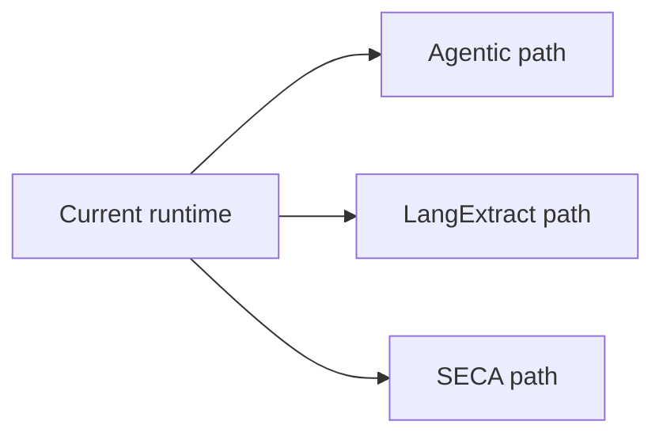
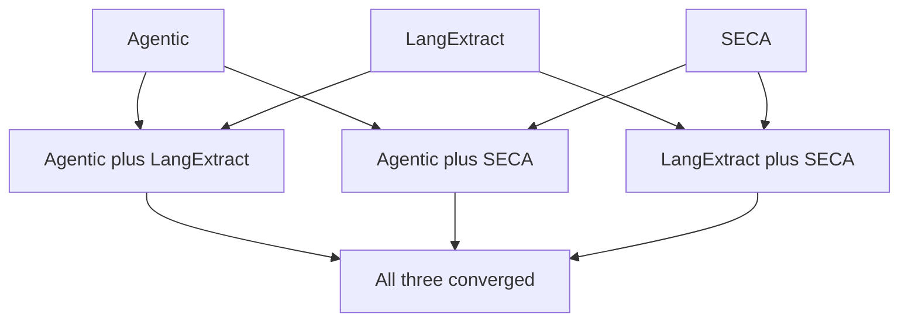

# Future Path Intersections (Optional and Non-Default)

This document describes optional intersections between the three independent future paths:

- Agentic Workflow path
- LangExtract path
- SECA-based path

None of these intersections are active runtime behavior in this repository.

## Separation first

Each path can progress independently. Intersections are optional and should be treated as later design opportunities.

## Path relationship map

## Optional pairwise intersections

## Agentic plus LangExtract

- Agentic controls extraction policy and retries
- LangExtract provides structured Story Frames
- Benefit: stronger orchestration over extraction quality loops

## Agentic plus SECA

- Agentic controls branching and replay for SECA runs
- SECA provides alternative clustering outcomes
- Benefit: safer experimentation and rollback behavior

## LangExtract plus SECA

- Story Frames can be consumed as additional clustering signals
- SECA can operate with or without frame augmentation
- Benefit: improved story identity robustness
- This intersection is optional and not required for either path to progress independently

## Full convergence

Full convergence is explicitly non-default and requires independent validation of each path first.

## Preconditions for any intersection

- clear interface contracts across path boundaries
- run metadata compatibility
- reproducibility for intersected path behavior
- operational observability for intersection-specific outcomes

## Non-goals

- Declaring a merged roadmap as mandatory
- Reclassifying future paths as current runtime behavior
- Implicitly changing production architecture

Back to orientation: [Onboarding Index](./index.md).
