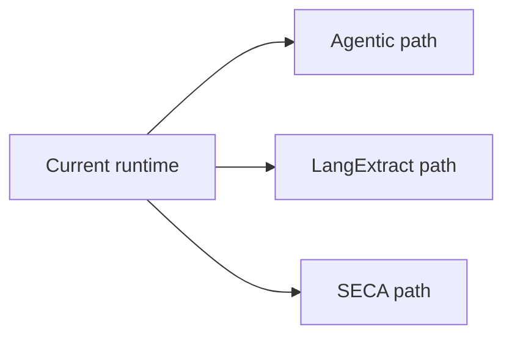
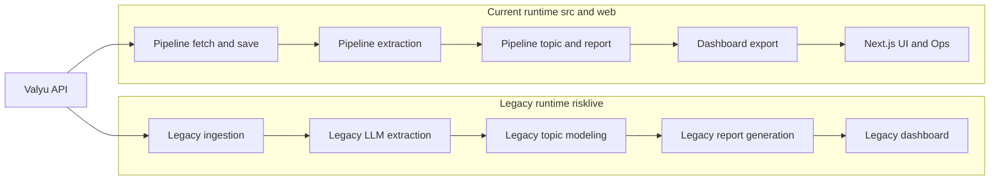

# RiskLive Onboarding Guide

This guide is the fastest path to understand how RiskLive works and why the current implementation differs from legacy.

## Status legend

- `Current Runtime`: implemented and used by this repository today
- `Legacy Baseline`: historical implementation retained for context
- `Future Path`: documented direction that is not active runtime
- `External Validated Prototype`: implemented outside this repository, validated externally, not integrated here

## How to read this set

- Management track: this page -> [Improvements Over Legacy](./improvements-over-legacy.md) -> [SECA Evaluation Blueprint](./seca-evaluation-blueprint.md)
- Domain expert track: [Current Architecture](./current-architecture.md) -> [LangExtract Path](./langextract-path.md) -> [SECA Path](./seca-path.md)
- New hire engineering track: [Legacy Baseline](./legacy-baseline.md) -> [Current Architecture](./current-architecture.md) -> future-path docs as needed

## What Is Legacy vs Current

- Legacy implementation (`Legacy Baseline`): `risklive/` package (older Flask/Streamlit/script-oriented flow)
- Current implementation (`Current Runtime`): `src/` (pipeline services + structured logging) and `web/` (Next.js UI and `/ops`)

## Future Paths (Separate for now)

RiskLive has three future paths that are independent at this stage:

- Agentic Workflow path (orchestration and execution control)
- LangExtract path (structured story-frame extraction)
- SECA-based path (alternative clustering method, `External Validated Prototype`)

These paths may intersect later, but there is no current requirement that any one path depends on another.

## Improvement-First Summary

| Area | Legacy | Current | Why It Matters |
| --- | --- | --- | --- |
| Pipeline orchestration | Script/function coupling | Explicit stages in `src/services/pipeline.py` | Faster debugging and safer changes |
| Data contracts | Implicit CSV/DataFrame shape | Typed models in `src/models/*` | Fewer schema regressions |
| Logging | Mostly free-form | Structured JSON contract in `src/utils/logging.py` | Reliable ops health and incident analysis |
| Operations visibility | Manual/artifact inference | `/ops` computed from run/stage/scheduler logs | Status aligned with execution truth |
| Web delivery | Legacy dashboard patterns | Next.js app in `web/` + API routes | Better UX isolation and testability |
| Deployment boundary | Mostly process-level setup | Docker Compose + Caddy edge controls | Reproducibility and safer internet exposure |
| Test coverage | No comprehensive suite | Comprehensive unit and integration test suite | Safer releases and stronger regression protection |

## System Map

## Read Next

- [Legacy Baseline](./legacy-baseline.md)
- [Current Architecture](./current-architecture.md)
- [Improvements Over Legacy](./improvements-over-legacy.md)
- [Agentic Workflow Groundwork](./agentic-groundwork.md)
- [LangExtract Path](./langextract-path.md)
- [SECA Path](./seca-path.md)
- [SECA Evaluation Blueprint](./seca-evaluation-blueprint.md) (required decision gate before SECA adoption discussion)
- [Future Path Intersections](./future-path-intersections.md)
