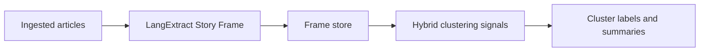
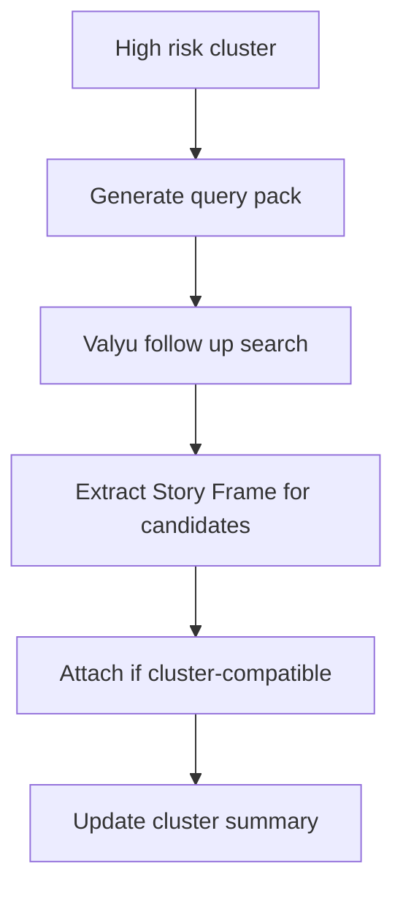

# LangExtract Path (Future Path)

This document describes the LangExtract path for RiskLive. It is a **future path** and is **separate** from the Agentic Workflow path and the SECA path.

## Status

- Classification: Future path
- Current runtime status in this repository: Not active
- Scope: structured extraction for story identity and retrieval metadata
- Source design note: `docs/LangExtract in RiskLive.md`

## Why this path exists

RiskLive needs stronger same-story grouping signals across outlets. LangExtract can produce typed intermediate objects (Story Frames) that improve cross-source comparability and interpretability.

## Story Frame contract (target)

- `event_type`
- `actors`
- `dates`
- `locations`
- `key_claims`
- `key_terms`

This frame is optimized for story identity and retrieval support, not full risk judgement.

## Proposed LangExtract flow (future)

## Relationship to current runtime

Current runtime clustering continues to be BERTopic-based in `src/services/topic_modeling/modeling.py`. LangExtract path does not replace that path by default.

## High-risk follow-up search loop

For high-risk clusters, Story Frames can generate targeted query packs for follow-up retrieval.

## Quality and risk controls

- Keep clustering hybrid (semantic similarity plus frame overlap)
- Prevent over-merging with multi-signal match criteria
- Use fallback behavior when frames are partial
- Track extraction quality and drift by run

## Non-goals

- Introducing an agentic orchestrator by default
- Replacing topic model method by default
- Declaring SECA dependency

## Acceptance criteria for this documentation path

- Story Frame fields and purpose are explicit
- Proposed loop for high-risk follow-up is clear
- Separation from agentic and SECA paths is explicit
- Mermaid diagrams render without syntax errors

Back to orientation: [Onboarding Index](./index.md).
