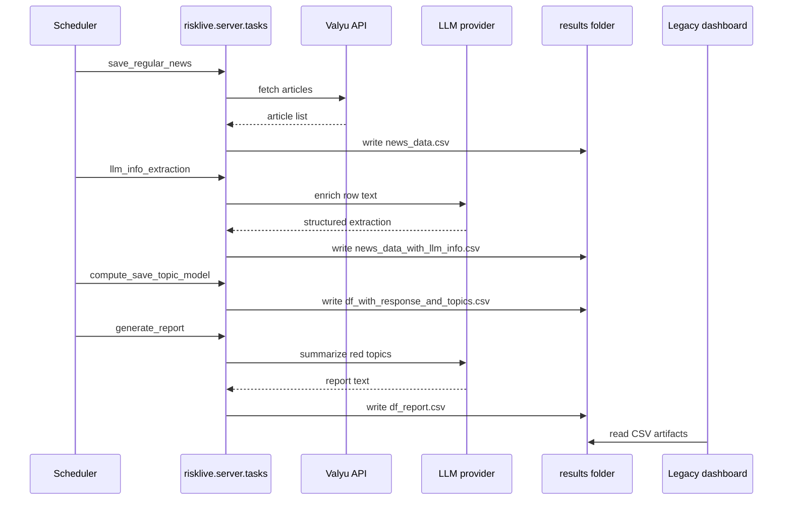
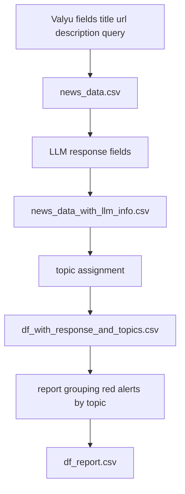

# Legacy Baseline (`risklive/`)

This document describes the legacy runtime so new team members can understand historical behavior and compare it to the current stack.

## Purpose

Legacy RiskLive ingests Valyu news, enriches rows with LLM extraction, clusters topics, generates report rows, and renders dashboard outputs from CSV artifacts under `results/`.

## Tech Stack (Legacy)

- Python
- Flask + APScheduler (`risklive/server`)
- Streamlit dashboards (`risklive/dashboard`)
- pandas-centric CSV processing
- BERTopic + HDBSCAN + sentence-transformers for topic modeling
- Azure OpenAI integrations in legacy data-processing modules

## Legacy Execution Paths

- API and scheduler: `python -m risklive.server.app`
- One-shot full run: `python -m risklive.jumpstart`
- Legacy dashboard path: modules under `risklive/dashboard/`

## Legacy End-to-End Data Flow

```mermaid
flowchart LR
    A[Valyu API]
    B[aggregate_regular_news]
    C[results data news_data.csv]
    D[process_df LLM extraction]
    E[results data news_data_with_llm_info.csv]
    F[compute_topic_modeling]
    G[results data df_with_response_and_topics.csv]
    H[get_report]
    I[results data df_report.csv]
    J[legacy dashboards]
    A --> B --> C --> D --> E --> F --> G --> H --> I --> J
```

## Legacy Sequence

## Legacy Field Lineage

## Legacy Logging and Ops Behavior

- Logging exists but is less standardized than current structured contracts.
- Operational state is often inferred from file outputs and process logs rather than strict stage-event semantics.
- Incident triage can require manual interpretation across scripts.

## Legacy Constraints

- Weaker stage boundaries and less explicit contracts.
- More implicit assumptions in CSV schema and DataFrame operations.
- Harder to derive reliable health from logs alone.

This baseline is the reference point for understanding improvements in the current implementation.

Back to orientation: [Onboarding Index](./index.md).
