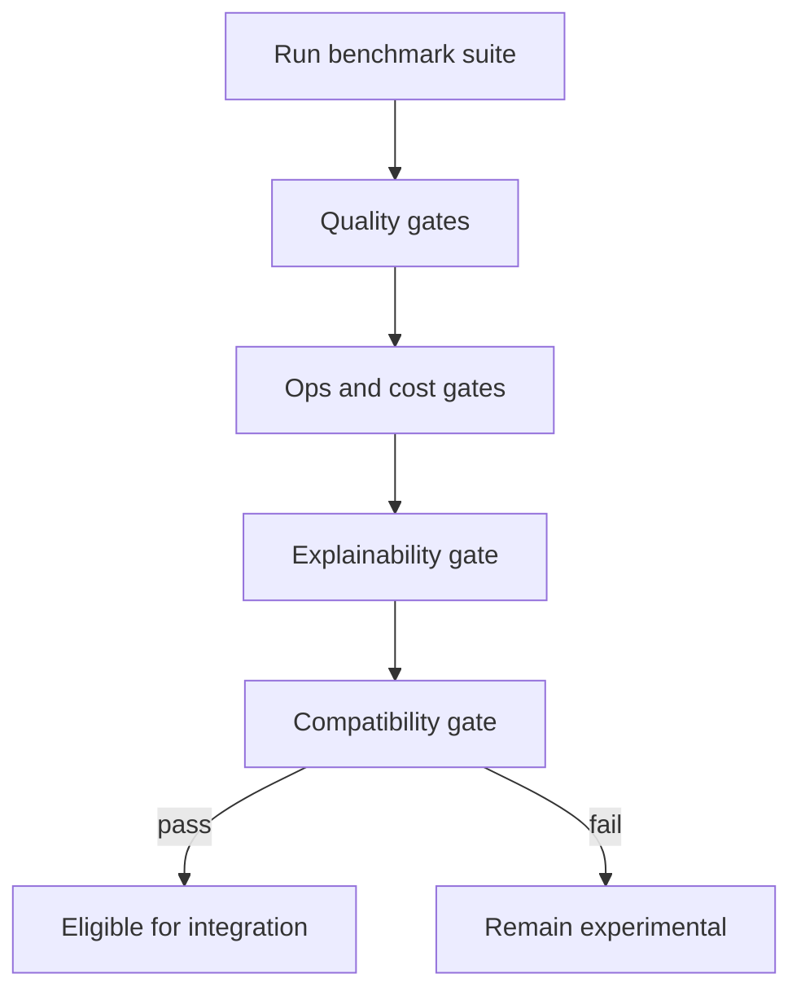

# SECA Evaluation Blueprint

This blueprint defines how to evaluate the SECA-based method against the current RiskLive topic-modeling path before any integration decision.

## Status

- Classification: evaluation blueprint
- Current runtime impact: none
- Scope: benchmark design and decision gates
- Non-goal: direct runtime replacement

## Evaluation questions

- Does SECA reduce same-story fragmentation compared to the current BERTopic path?
- Does SECA improve cluster quality without increasing false merges?
- Does SECA improve explainability for topic evolution analysis?
- What are the runtime and sustainability tradeoffs?

## Candidate set

- Baseline A: current BERTopic stage (`src/services/topic_modeling/modeling.py`)
- Candidate B: SECA
- Optional Candidate C: SECA-Light

## Metrics

### Cluster quality

- NMI
- BCubed F1
- Purity

### Event coverage

- Recall on labeled event sets

### Operational profile

- Runtime per batch
- Memory profile
- Failure rate

### Sustainability profile

- Per-run carbon/energy proxy metric

### Explainability scorecard

- Can analysts explain why cluster changes occurred?
- Can operators trace evidence for cluster evolution decisions?

## Data protocol

- Use replayable historical slices from existing RiskLive artifacts.
- Use fixed batch windows to test dynamic evolution behavior.
- Version all benchmark inputs and labels for reproducibility.

## Decision gates

1. Quality gate:
SECA should be non-regressive on core quality metrics, with clear improvement on at least one key quality objective (for example, reduced same-story fragmentation).

2. Operational gate:
Runtime and reliability must remain within acceptable operational bounds for scheduled runs.

3. Explainability gate:
Outputs must provide enough structure to support analyst and ops interpretation.

4. Compatibility gate:
Output contracts must remain compatible with report generation and dashboard export stages.

## Decision flow

## Integration contract (if gates pass)

- Input contract: enriched records compatible with current post-extraction rows.
- Output contract: topic assignments compatible with `generate_report` and dashboard export expectations.
- Metadata contract: run identity, method version, and config fingerprint for lineage.

## Risk interpretation notes

- Strong performance in one environment does not imply universal improvement in RiskLive workloads.
- Non-significant result differences in some comparisons should be treated as a signal to benchmark with domain-specific data.
- Integration should remain optional unless benchmark gates are consistently met.

## Acceptance criteria for this blueprint

- Evaluation questions are explicit and measurable.
- Candidate and baseline methods are unambiguous.
- Decision gates support a clear go/no-go outcome.
- Compatibility requirements are explicit for downstream stages.

Back to orientation: [Onboarding Index](./index.md).
