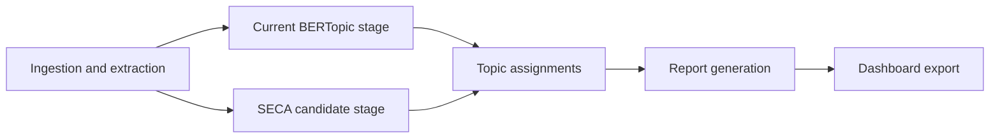

# SECA-Based Path (Future Path)

This document describes the SECA-based path for RiskLive. It is a **future path** and is **separate** from the Agentic Workflow path and the LangExtract path.

## Status

- Classification: Future path
- Evidence level: External validated prototype
- Implementation location: Different project (outside this repository)
- Current runtime status in this repository: Not active

## Reference

- Root PDF in this repository: `713d2a5c-42e1-45ce-bd09-c62d27a7ac56.pdf`
- Local text extraction used for review: `seca_paper.txt`
- Claims in this document are grounded in the paper text and are treated as external evidence until validated on RiskLive data.

## Why this path exists

SECA-based methods target better event/story clustering quality and explainability under noisy short-text conditions.

## Benefits for RiskLive (paper-backed)

The SECA paper claims benefits that map directly to RiskLive requirements:

- Better handling of evolving topics over time via self-evolving contextual structures.
- Better visibility of topic and sub-topic relationships instead of flat cluster labels.
- Better explainability for why changes happened, not just what clusters exist.
- Competitive cluster quality across metrics such as NMI, BCubed F1, and purity.
- Favorable carbon profile for SECA-Light relative to heavier baselines in the paper's setup.

Important caveat: one event-coverage comparison reported non-significant differences between top-performing methods in that setup. SECA should therefore be benchmarked in RiskLive before any adoption decision.

## Position relative to current runtime

Current runtime topic modeling remains BERTopic-based (`src/services/topic_modeling/modeling.py`).

The SECA path is an optional alternative branch, not a replacement commitment.

## RiskLive fit points

| Current Stage | Candidate SECA Role | Compatibility Requirement |
| --- | --- | --- |
| Enriched rows ready | Alternative clustering engine | Accept enriched row contract used today |
| Topic assignment output | Produce `topic` assignments | Output schema must be compatible with report stage |
| Report generation | Reuse existing stage | `generate_report` input expectations remain satisfied |
| Dashboard export | Reuse existing stage | Exporters continue receiving compatible topic fields |

## Conceptual integration contract (future)

A future in-repo integration would require:

- input compatibility with enriched article records
- output compatibility with current downstream consumers (`topic` assignments and report pipeline)
- run metadata compatibility (`run_id`, method version, config fingerprint)
- artifact compatibility for dashboard export expectations

## Candidate insertion flow

## Evaluation criteria before integration

- same-story recall improvement
- cluster purity improvement
- false merge and false split behavior
- runtime cost profile
- reproducibility under fixed configuration

Detailed benchmark process: [SECA Evaluation Blueprint](./seca-evaluation-blueprint.md).

## Non-goals

- Claiming SECA is currently running in this repository
- Making SECA mandatory for LangExtract path
- Making SECA mandatory for agentic path

## Acceptance criteria for this documentation path

- External prototype status is explicit and repeated
- Integration requirements are concrete but non-committal
- Separation from other future paths is explicit
- Mermaid diagram renders without syntax errors

Back to orientation: [Onboarding Index](./index.md).
